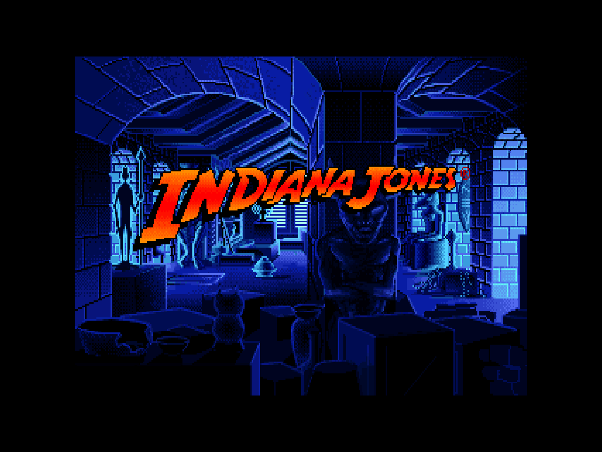
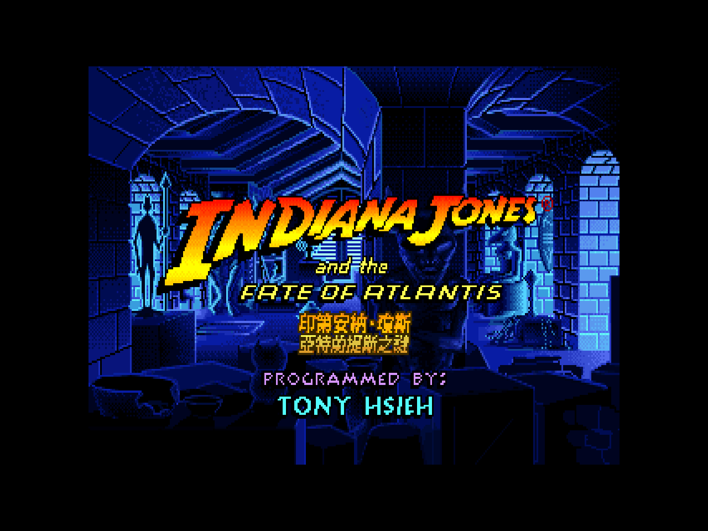
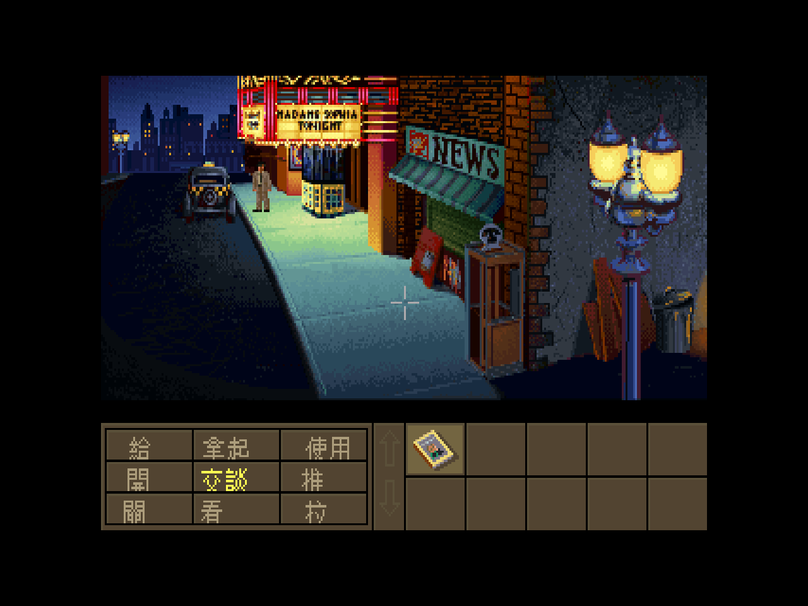
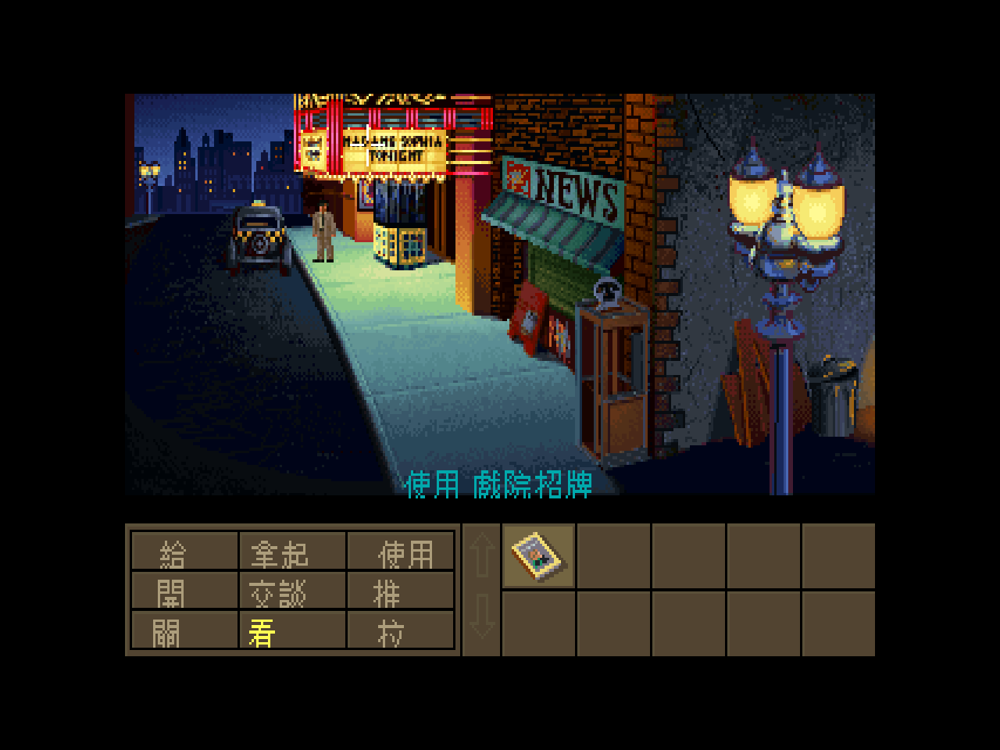
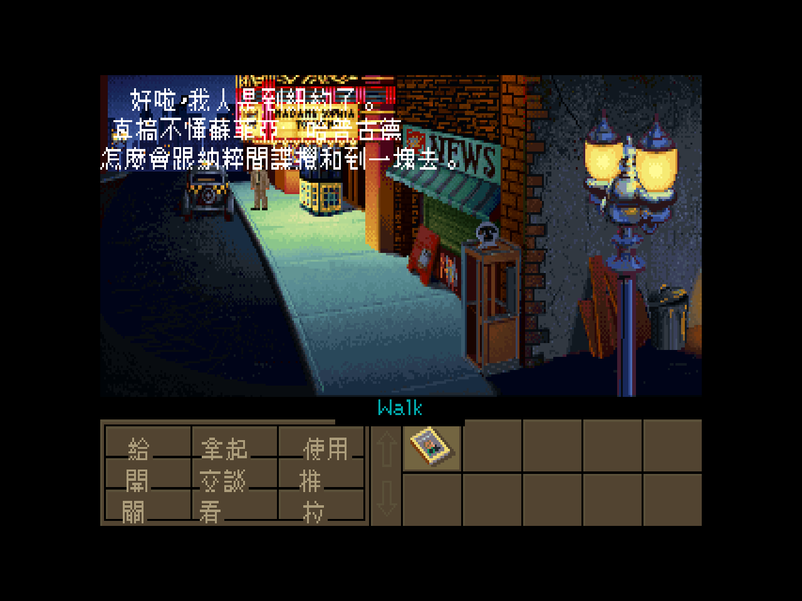
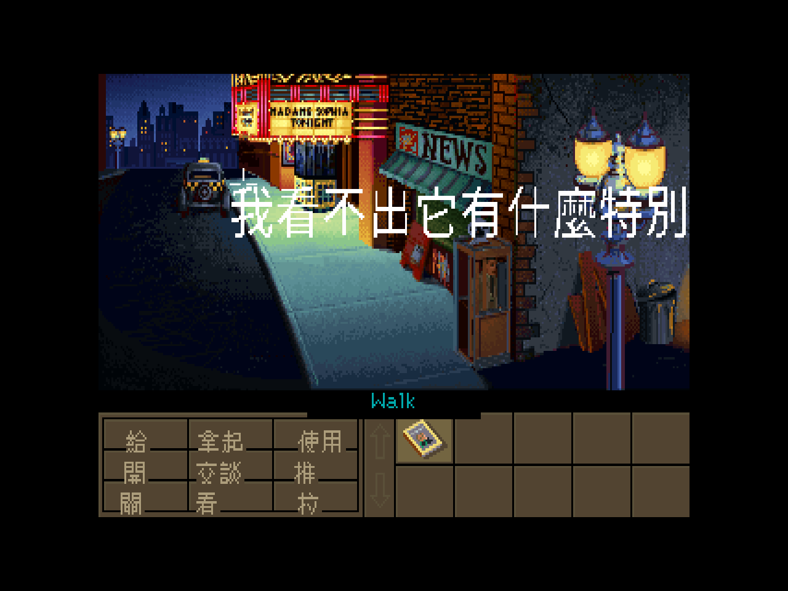

# 印第安納·瓊斯:亞特蘭提斯之謎 — 繁體中文化

> *Indiana Jones and the Fate of Atlantis*(LucasArts, 1992)SCUMM v5 CD 語音版的繁體中文化專案。
> 不改一個 byte 的原版資料,改的是 ScummVM:在繪字處攔截英文 → 查表 → 用點陣中文字重畫。
> **目標:讓這款從沒有官方中文版的神作,用印第的口吻講繁體中文。**

還記得嗎?那是 1992 年,《法櫃奇兵》《聖戰奇兵》之後,大銀幕沒給我們第四集,LucasArts 卻用一張磁片給了——一部**你自己操控的印第安納·瓊斯電影**。鞭子、納粹、柏拉圖失落的對話錄、沉在海底一萬年的亞特蘭提斯。那年我們十幾歲,守著 14 吋 CRT,對著滿螢幕英文一句一句查《軟體世界》的攻略,硬是把它破關了。

三十幾年過去。這個 repo 想做的,是把當年那台機器上沒能給我們的東西補上:**一份能讀的中文**。

這份說明你可以三層讀:想看成果就讀 [我們做了什麼](#contrib);想重溫這款遊戲為什麼是神作,讀 [一部你能操控的電影](#magazine);想看技術怎麼挖的,跳到 [資料考古](#tech)。

---

## 目錄

- [我們做了什麼](#contrib)
- [一部你能操控的電影](#magazine)
- [當年,在台灣](#taiwan)
- [資料考古:SCUMM v5 與那個消失的索引檔](#tech)
- [中文化路線](#route)
- [快速開始](#quickstart)
- [譯名與攻略致謝](#credits)
- [後續藍圖](#roadmap)
- [資料來源](#sources)

---

<a name="contrib"></a>
## 我們做了什麼

一句話:**讓一款 1992 年、從來沒有官方中文版的點擊冒險神作,在 ScummVM 裡用印第安納·瓊斯的口吻講繁體中文——字幕全翻完了,連語音都換成了中文配音。**

它先是原封不動地開起來——那張我們三十年前看過的開場標題:



然後,連那張標題都說起了中文。我們在 **INDIANA JONES** 的橘金 logo 下,補上**設計過的中文片名**——主標 **印第安納·瓊斯** 走同款橘金漸層、副標 **亞特蘭提斯之謎** 走 FATE OF ATLANTIS 那種黃色斜體,描邊、配色都對著原版 logo 調,塞進英文標題與工作人員名單之間的那道縫裡,不搶戲、不突兀。引擎在標題房即時把這兩行字按當下調色盤配色疊上去,連淡入都跟著 logo 一起亮起來:



原版的操作介面是滿屏英文:底部那排動詞(Give / Pick up / Use / Open / Talk to / Push / Close / Look at / Pull)、青色的句子列、物品欄:


加上引擎 CJK patch、查表把英文換成 Big5、走 scumm 既有的雙位元組繪字路徑之後——**同一個畫面,底部整排變中文了**:



> 給 · 拿起 · 使用 / 開 · **交談** · 推 / 關 · 看 · 拉。

那條夾在畫面與面板接縫上、只有 12 像素高的青色**句子列**,一度是最容易出包的地方——中文字筆畫多,擠在那道交界上,字頂常被削掉一截,玩家看著半截字猜動作。現在它穩穩坐在縫上,一個筆畫都不缺:



> 把游標移到戲院招牌上,句子列就吐出一整行**使用 戲院招牌**——青色十二點陣,完整落在房間與面板的接縫上,頭尾都不再被裁。

接著是最關鍵的一步——**讓印第開口**。瓊斯一到紐約,內心獨白自動跳出來,三行斷得好好的:



> 「好啦,我人是到紐約了。真搞不懂蘇菲亞·哈普古德怎麼會跟納粹間諜攪和到一塊去。」

這不是字面直譯,是**印第的口吻**:那股「都火燒眉毛了還在碎念」的乾。

對白不只發生在劇情過場。SCUMM 冒險遊戲的靈魂是**「看」遍場景每一樣東西**——拿「看」這個動詞點下去,瓊斯就會給你一句評語。同一套漢化路徑接到了這條線上,連這種隨手一瞥的吐槽都是中文,而且照樣是那股乾:



> 對著街上某個東西按「看」——「**我看不出它有什麼特別**」。字大、置中、24×24 點陣,不是把中文硬塞回原版那行 8 像素小字的位置(那樣會糊成一團),是把整個內部畫布拉高再畫上去。

這套路徑接上去之後,**玩家在遊戲裡看得到的對白,全部翻完了——4760 條繁體中文**。從 Barnett 閣樓的開場、紐約街頭,一路鋪到亞特蘭提斯三條結局線;沒翻的只剩製作群名單、引擎碎片、熱點物件的內部代碼,你玩起來一句都碰不到。譯文照的是 [CONTEXT.md](CONTEXT.md) 那條鐵則:字面對、語氣痞、危險時還能開玩笑。隨手幾句你大概會心一笑:

> 「我是考古學家,不是水管工。」
> 「我最討厭蛇了。」
> 蘇菲亞回敬印第:「我們不是在約會,瓊斯。這不是約會。」

最後賭氣那段火力全開——印第把自己的豐功偉業一口氣報出來:「**那個找到約櫃的人、那個尋回桑卡拉石的人、那個親手摸到聖杯的人!**」三部曲電影一次致敬,全是繁體中文。

### 讓印第用中文開口:中文配音

字幕翻完只是一半。1993 年那張 CD 最值錢的東西是**語音**——LucasArts 錄了八千多句英文對白,把默片變成有聲電影(來龍去脈見 [一部你能操控的電影](#magazine))。我們做的第二件事,就是**把那層語音也換成中文**:遊戲跑到任何一個會發聲的點,引擎本來要播的英文語音被即時攔下,換成自家中文配音——**5552 個語音點全部重導**。

更講究的是**分角色配音**。印第的嗓子特地調成老玩家最熟的那個味道——**台灣《馬蓋仙》配音那種沉穩又帶點痞的腔**;蘇菲亞·哈普古德走台灣女聲,自己一條獨立聲線,581 句。兩個人鬥起嘴來,拍子對得上 1940 年代冒險片該有的節奏。

要原汁原味也沒問題:**遊戲中按 F8 切字幕語言(中 / 英),按 F9 切語音(中 / 英)**。想聽道格·李的原版英配、配中文字幕?按兩個鍵的事。

### 技術上,難在哪、怎麼破

| 關卡 | 我們的解法 |
|---|---|
| **Steam 複本缺索引檔** `ATLANTIS.000`,ScummVM 認不出遊戲 | 從 CD 版 ISO 補回索引;CD 版 `.001` 的 md5 與 Steam 版**完全相同**,證明同版本,先前抽的字一句沒白費 |
| willy 版 ScummVM **只編了 dgds 引擎**,FOA 偵測得到卻報「找不到引擎」 | reconfigure 把 **scumm 引擎**編進去(`GID_INDY4`) |
| 老遊戲做中文化,常見死路是「自己寫一層疊圖層」 | 翻原始碼發現 scumm **本來就會畫雙位元組中日韓字**,還內建 `ZH_TWN`(繁中 Big5)路徑——直接接管,遮罩 / 定位 / 還原全免費 |
| 動詞格只有 ~10px 高,24px 中文會重疊 | 用 12×12(與引擎簡體 GB 版同尺寸);loader 從字型 header 讀尺寸,換字型免重編 |
| 離線抽字有碎片,翻了不一定對得上遊戲真正畫的字串 | 加 **runtime 攔截**:patch 把每句畫出來卻沒翻的英文 log 出來,翻的是引擎真正顯示的字串,一翻就中 |

整條管線——CD ISO 補索引 → scumm 引擎 → Big5 點陣字 → CJK patch → runtime 攔截 → 印第口吻翻譯——都跑通了。完整分階段見 **[PLAN.md](PLAN.md)**,技術考古見 [資料考古](#tech)。

> 那句「能不能做」早就翻篇了。字幕 4760 條翻完、語音 5552 點重配完、F8 / F9 隨手切——這款 1992 年的神作,現在真的用印第的口吻講繁體中文了。

---

<a name="magazine"></a>
## 一部你能操控的電影

上一段講了成果,但成果表撐不起這款遊戲在我們心裡的份量。先說說它為什麼值得有中文版。

老冒險迷絕對記得那個開場:瓊斯博士在自家博物館的閣樓翻箱倒櫃,為了一尊牛角小雕像,結果一鞭子下去,牽出了沉睡一萬年的亞特蘭提斯。這不是隨便編的。Hal Barwood 與 Noah Falstein 把柏拉圖《對話錄》裡那段真實存在的亞特蘭提斯記載,當成整條主線的考據起點——你蒐集的不是寶物,是**線索**:山銅(orichalcum)、失落的城邦、Nur-Ab-Sal 的王冠。

**這款遊戲最狠的設計是**:玩到中段,它會問你怎麼繼續——靠腦袋(Wits)、靠拳頭(Fists),還是帶著女主角蘇菲亞一起(Team)?**三條路,三套謎題,三種過法**。一款 1992 年的遊戲做到這個格局,放到今天都不算過時——它是 LucasArts 第七款用 SCUMM 引擎做的遊戲,也是公認把這套系統推到巔峰的一作。

蘇菲亞·哈普古德更是少見的女主角寫法:她不是被救的公主,是瓊斯的前同事、現在靠通靈吃飯的考古學家,嘴利、有主見,還真的會在謎題裡幫上忙。瓊斯和她一路鬥嘴到亞特蘭提斯,那股 1940 年代冒險片的對白節奏,是這款遊戲的靈魂。

**最讓老玩家難忘的是 1993 年那張 CD。** 它不是把磁片內容燒進光碟交差了事——LucasArts 找了配音員,錄下**八千多句對白**,讓整款遊戲從默片變成有聲電影。有趣的是,電影裡的哈里遜·福特沒來配音,印第的聲音換成了替身演員道格·李(Doug Lee)。也正是這個 talkie 版的資料(`MONSTER.SOU`,150 MB 純語音),成了這個中文化專案的標的——三十年後,這整層英文語音被換成了中文配音(見 [我們做了什麼](#contrib))。

當年它橫掃媒體:QuestBusters 說它「不只是 LucasArts 做過最好的冒險遊戲……大概是有史以來最棒的圖像冒險」;《電腦遊戲世界》(Computer Gaming World)選它為 1992 年最佳冒險遊戲之一;銷量破百萬套。而當年的我們,是隔著一層英文在看這部電影的。

---

<a name="taiwan"></a>
## 當年,在台灣

講完遊戲本身,接著講一件更貼身的事:三十年前,我們是怎麼玩到它的。

那時候沒有 GameFAQ、沒有 Discord、沒有 wiki。一款這麼大的美式冒險遊戲在台灣**從來沒有出過官方中文版**——我們玩的是水貨磁片、是朋友拷貝的版本,對著一句句英文謎題卡關。能破關,靠的是書局架上那幾本印刷油墨還沒乾的雜誌:**《軟體世界》《電腦玩家》**這類三大誌的攻略專欄,還有 BBS 上的討論板。

這個 repo 裡就躺著兩份那個年代的證物——兩篇 1990s 的中文攻略:一篇是**青衫**寫的逐步流程(三條路線全包),一篇是**曾昭朋**寫的漸進式提示。後者的問句語氣,本身就是那個年代的台味機鋒:

> 「這是什麼世界!坐熱氣球還要票!給錢不行嗎?」
> 「#※☆◎※!鬼才知道他背後有幾根手指!」
> 「別問我!這個遊戲又不是我設計的!」

讀著讀著你會發現,**這不就是印第本人會說的話嗎?** 這也成了本專案譯文的定調:不要翻譯腔,要那股痞、那股黑色幽默(見 [CONTEXT.md](CONTEXT.md)「對話風格」)。

當年三大誌的編輯們,在沒有中文版的情況下,用一篇篇攻略陪我們走完了亞特蘭提斯。三十年後,這個 repo 想把那件他們沒能做的事補上:**讓這款遊戲真正開口講中文。**

---

<a name="tech"></a>
## 資料考古:SCUMM v5 與那個消失的索引檔

講完情懷,接下來是冷的部分——這批資料到底長什麼樣,以及第一塊絆腳石是怎麼被挖出來的。

### 引擎與版本鑑定

`ATLANTIS.001` 開頭 16 bytes 與常數 `0x69` 逐 byte XOR 後,得到 `LECF ... LOFF`——SCUMM v5 的容器標記。`ATLANTIS.EXE` 內字串 `5.5.00 (May 05 1993 18:15:17)` 與 `iMUSE, patents pending, tm & (c) 1993 LucasArts` 進一步定版:這是 1993 年的 **256 色 CD 語音版**(`MONSTER.SOU` 即 150 MB 數位語音)。

```
ATLANTIS.001  (XOR 0x69)
└─ LECF                  容器
   ├─ LOFF               房間位移表
   ├─ LFLF  × 96         每個 = 一間房 + 其資源
   │  ├─ ROOM            RMHD / CYCL / PALS / OBIM* / OBCD* / LSCR* / EXCD / ENCD …
   │  ├─ SCRP            全域腳本(對白內嵌)
   │  ├─ SOUN / COST / CHAR
   │  └─ …
```

區塊頭 = 4-byte ASCII tag + 4-byte big-endian size(含 8-byte header)。`tools/scumm_v5.py` 走完整棵樹,從 SCRP/LSCR/VERB/OBNA 解出 ~5450 句字串。

### 那個消失的索引檔

但這裡撞到第一道牆。SCUMM v5 的遊戲資料是**兩個檔**:`.001`(資料)+ `.000`(索引)。索引檔存的是「全域腳本 / 音效 / 服裝 / 字型的**編號 → 位移**」對照表——而 `.001` 裡的區塊**只有 tag 和 size,沒有編號**。這份 Steam 複本只有 `.001`,缺 `.000`,而且**沒辦法只憑 `.001` 重建**(編號資訊已遺失,硬湊只會叫錯腳本)。

解法是那張 **CD 版 ISO**:裡頭帶著完整的 `ATLANTIS.000`(12 KB 索引)。關鍵一點——CD 版的 `.001` 與 Steam 版 **md5 完全相同**,證明同版本,先前在 Steam 資料上做的抽字一句都沒白費。補上索引後:

```
$ scummvm --detect --path="atlantis/game"
scumm:atlantis   Indiana Jones and the Fate of Atlantis (CD/DOS/English)
```

石頭搬開了。從這裡開始,遊戲能跑、能改、能截圖。

### 語音重導與動詞格對齊

兩個收尾的工程細節,一併記在這。

**中文配音重導。** 原版語音裝在 `MONSTER.SOU`(VOC 音檔串接 + offset 索引)。引擎播放語音前,以 voice offset 為鍵查 `atlantis_voice.tab`;命中即把該語音點導向自家中文 `.voc`,共 **5552 個語音點**被重導。配音以 edge-tts 烘製、分角色:印第用 `zh-TW-YunJheNeural`(語速 -8%、音高 -12Hz,逼近《馬蓋仙》嗓),蘇菲亞用 `zh-TW-HsiaoChenNeural`(581 句)。`F9` 在中 / 英語音間切換,`F8` 切字幕語言。原始 `MONSTER.SOU` 一個 byte 都沒改,重導發生在播放層。

**動詞格對齊。** 底部動詞面板載入 `atlantis_zh16.dcjk`(內含 12×12 點陣)當 UI 字。早期版本字的基線偏上,按鈕格的分隔線會穿過筆畫;`drawVerb` 對 Big5 動詞加一個垂直微調(`_chtVerbYOffset`),修正後 12px 字在每個格內**垂直置中**,分隔線不再切到字(對照 [中文介面截圖](#contrib))。

**標題疊圖。** 中文片名不是點陣字硬寫,是離線設計好的圖:`tools/title/design_title.py`(docker + PIL)把「印第安納·瓊斯 / 亞特蘭提斯之謎」渲成黃橘漸層 + 深棕描邊 + 斜體,nearest 縮成像素風,烘成 `atlantis_title.spr`(`[u16 x][u16 y][u16 w][u16 h]` + RGBA)。`drawAtlantisTitle()` 掛在 `drawDirtyScreenParts()` 尾端,只在標題房(room 4)生效:對每個不透明像素用當下 `_currentPalette` 做**最近色比對**再寫進 framebuffer——所以淡入時中文跟著 logo 一起由暗轉亮,顏色永遠對得上調色盤。原版標題圖一個 byte 沒改。

---

<a name="route"></a>
## 中文化路線

原本打算照姊妹作《威利奇遇記》(`~/willy`,ScummVM `dgds` 引擎)的做法,自己寫一層繪字疊圖層。但翻 scumm 引擎原始碼時發現一件事:**它本來就會畫雙位元組中日韓字**——日文 FM-Towns、韓文、簡體 GB 版都靠這條路;而且裡頭**已經有一個 `ZH_TWN`(繁體 Big5)分支**,只是被限制在較晚的 v7/v8 遊戲。

所以路線改成「接管現成的路,不另起爐灶」:

- **不改遊戲資料**——原版 `.001` 一個 byte 都不動,改的是 ScummVM。
- 把亞特蘭提斯(v5)接上引擎既有的 `ZH_TWN` 繪字路徑,字型索引換成自家 Big5 線性版。**遮罩、定位、文字還原這些麻煩事,引擎全包了。**
- 繪字前在 `drawString`(動詞 / 句子列)與 `actorTalk`(對白)兩處攔截:**英文原文查表 → 換成 Big5 → 交給既有渲染器畫**。多行對白用 `\n` 標斷行,引擎自己換行。
- **runtime 攔截**:把引擎真正畫出來、卻還沒翻的字串 log 出來,確保翻的是遊戲實際顯示的句子。
- 字級隨版位而定:動詞格只有約 10px 高,用 12×12 並**垂直置中於格內**;對白走 24×24 大字,拉高內部畫布再畫,**不把中文縮小硬塞**(rule:拉高畫布,別縮字)。
- **語音同一套攔截**:引擎播語音前查 `atlantis_voice.tab`,把命中的語音點導向自家中文 `.voc`(共 5552 點),原版英配保留,`F9` 切回。

完整 patch(8 個改檔 + `cjk_cht.{h,cpp}` 共 10 檔)見 `patches/scumm-cjk.patch`;與 willy 的逐項差異見 [PLAN.md](PLAN.md#與-willy-的關鍵差異必讀)。

---

<a name="quickstart"></a>
## 快速開始

三個平台都有打包好的版本,下載解開就能玩;也可以自己套 patch 編。

### 下載即玩

每個包裡都附一份 `使用說明.txt`,寫了該平台的啟動方式與第一次執行要注意的點。共通操作:遊戲中 **F5** 叫選單(存檔 / 讀檔)、**F8** 切字幕語言(中 / 英)、**F9** 切語音(中 / 英)。

| 平台 | 怎麼跑 |
|---|---|
| **Windows**(x64) | 解開 zip,雙擊 `play.bat`。SmartScreen 跳警告 → 「更多資訊」→「仍要執行」。引擎靜態連結,只附 3 個 mingw runtime DLL。 |
| **Linux**(x86_64) | `chmod +x` 後執行單檔 `.AppImage`。缺 FUSE 就改 `./檔名.AppImage --appimage-extract-and-run`。 |
| **macOS**(universal:Intel + Apple Silicon) | 解開 `.tar.gz`,對 `.app` 按右鍵 →「打開」→ 再「打開」(未簽章);或終端機 `xattr -dr com.apple.quarantine <.app>`。需 macOS 11 以上。 |

公開版是 **slim**:含引擎 + 繁中字型 / 譯名 / 標題,**不含原版遊戲資料**。把你合法持有的 `ATLANTIS.000`、`ATLANTIS.001`、`MONSTER.SOU`(Steam / GOG 安裝目錄或原版光碟)放進包內 `data/`(Windows)或 `.AppImage` 旁(Linux),即可遊玩。內嵌遊戲與中文語音的 **full** 版含 LucasArts 版權資料,僅本機自留、不公開散布。

### 自己編(開發者)

1. 準備遊戲資料:CD 版 ISO 解開後的 `ATLANTIS/`(需含 `ATLANTIS.000` 索引),放成 `game/`。
2. 取 ScummVM 原始碼,套 `patches/scumm-cjk.patch`,以 `--enable-engine=scumm` 編譯。
3. 放進 `game/`:字型(`tools/build_cjk_font.py` 烘的 `atlantis_zh{12,16,24}.dcjk`)、譯表(`tools/build_translation.py` 由 `translations/zh.tsv` 編)、中文配音(`tools/build_voice.py` 接 `scripts/dub_batch.sh` 烘的 `game/voice/*.voc` 與 `atlantis_voice.tab`)、中文標題圖(`tools/title/design_title.py` 烘的 `atlantis_title.spr`,源檔在 `fonts/`)。啟動即偵測為 *Indiana Jones and the Fate of Atlantis*,介面 / 對白 / 語音全中文。
4. 打包:`scripts/package_appimage.sh slim|full`(Linux AppImage)、`scripts/build_windows_docker.sh` + `scripts/package_windows.sh slim|full`(Windows zip,docker cross-mingw)、`.github/workflows/build-macos.yml` 出 `.app` artifact 後 `scripts/package_macos_local.sh`(macOS universal)。各腳本自動附 `使用說明.txt`。

---

<a name="credits"></a>
## 譯名與攻略致謝

譯名以**遊戲內語料**為準,並對齊 1990s 中文圈通用譯法:瓊斯、印第、蘇菲亞、亞特蘭提斯、納粹。完整譯名表與對話風格見 [CONTEXT.md](CONTEXT.md)。

向那個沒有 wiki、只能靠雜誌與 BBS 攻略板撐過每一關的年代致謝,特別是兩位 1990s 攻略作者——**青衫**(逐步流程)與**曾昭朋**(漸進式提示)。他們的攻略不只幫我們破了關,連譯名與語氣都成了這份中文化的依據。**人名與拼字仍一律以遊戲語料為準**(攻略有 OCR 與人工翻譯誤差,例如反派 Kerner 在攻略前段以偽名 Smith 出現)。

> 攻略原文為第三方著作,只在本機作參考、不入庫(合理引用)。

---

<a name="roadmap"></a>
## 後續藍圖

完整六階段(補索引 → 抽字 → 烘字型 → 引擎 patch → 翻譯 → 打包驗證)見 **[PLAN.md](PLAN.md)**。字幕(4760 條)、中文配音(5552 點)、標題中文化都已收尾。

**打包**三個平台都產出了,各走最適合的路。共通設計:壓縮音訊編解碼全關(FOA 原版與中文配音都是 raw VOC),相依縮到只剩**自編的 SDL2** + zlib;原版 `ATLANTIS.001` / `MONSTER.SOU`(LucasArts 版權)與 272 MB 中文語音**只進本機完整包,不公開散布**。

| 平台 | 怎麼編 | 產物 |
|---|---|---|
| **Linux** | `scripts/package_appimage.sh slim\|full`,單檔 AppImage(bundle 相依 .so + AppRun) | slim 30 MB / **full 155 MB 開箱即玩**;均已實測獨立啟動 |
| **Windows** | `scripts/build_windows_docker.sh`,**docker cross-mingw** 自編 SDL2 靜態連結 → `scummvm.exe`(import 表全系統 DLL),`scripts/package_windows.sh` 合資料並 zip | slim 24 MB / full 150 MB zip;靜態 exe + 3 個 mingw runtime DLL |
| **macOS** | `.github/workflows/build-macos.yml`:`macos-14`(arm64)+ `macos-15-intel`(x86_64)**各自 native 編** → `lipo` 合 universal → `.app` artifact 回本機,`scripts/package_macos_local.sh` 合語音+遊戲 | **universal `.app`**(Intel + Apple Silicon),full 372 MB |

Linux full AppImage 獨立啟動已驗證(內嵌遊戲 + 中文標題正常);macOS CI 三 job 全綠、`lipo` 後 binary 確認雙弧。剩下的是定稿 [CONTEXT.md](CONTEXT.md) 幾個待確認譯名(Trottier / Sternhart 敬語、orichalcum 譯「山銅」或「奧利哈剛」)。

---

<a name="sources"></a>
## 資料來源

遊戲史實以下列來源交叉查證(維基百科 + LucasArts 一手資料):

- [Indiana Jones and the Fate of Atlantis — Wikipedia(英文)](https://en.wikipedia.org/wiki/Indiana_Jones_and_the_Fate_of_Atlantis):1992-06 發行、1993 CD talkie(~8000 句、Doug Lee 配音)、七款 SCUMM 之一、三線設計、Hal Barwood / Noah Falstein、獲獎與百萬銷量。
- [亞特蘭提斯之謎 — 維基百科(中文)](https://zh.wikipedia.org/zh-hant/%E4%BA%9E%E7%89%B9%E8%98%AD%E6%8F%90%E6%96%AF%E4%B9%8B%E8%AC%8E):中文標題、CD 版「從默片到有聲電影」的評價。
- 台灣 1990s 雜誌攻略(本機參考):青衫、曾昭朋兩篇——本專案譯名與語氣的時代依據。

> 說明:本作**未發行過官方繁體中文版**;當年台灣以水貨英文版流通,靠三大誌攻略破關。具體代理商查無可靠一手紀錄,故不臆測;這也是本專案存在的理由。

---

## 姊妹作:聖戰奇兵

同一套「不改原版、改 ScummVM 攔字重畫」的手法,我們也搬去做了印第三部曲電影本身的遊戲——**《印第安納·瓊斯:聖戰奇兵》**(*Last Crusade*,1989 LucasArts,FM-Towns 版,SCUMM v3)。那是當年**軟體世界**帶進台灣架上、六片磁片 NT$340 卻一句中文都沒有的那盒。這次連火車車廂的標題都補上了台灣片名,還給每個角色配了對味的中文(與英文)聲線:

[](https://github.com/wicanr2/indiana-jones-and-last-crusade-cht)

> ▶ **[印第安納·瓊斯:聖戰奇兵 繁中化](https://github.com/wicanr2/indiana-jones-and-last-crusade-cht)** — per-character 中文/英文配音(靜態反組譯講者地圖)、火車車廂標題中文疊圖、三平台開箱即玩。

---

> 版權:本 repo 只含工具、patch、翻譯表與文件。**遊戲原始資料、語音、執行檔、字型一律不入庫**,請自備合法 Steam / CD 版。
